_Last updated: 2026-04-05_

# System Architecture

## Overview

Boses is a full-stack SaaS application for running AI-powered market simulations. It consists of a Next.js frontend and a FastAPI backend, communicating via a versioned REST API secured with JWT httpOnly cookies.

## System Diagram

```mermaid
graph TB
    subgraph Client["Browser Client"]
        FE["Next.js 16.2.1 Frontend\napp.temujintechnologies.com"]
    end

    subgraph API["FastAPI Backend\napi.temujintechnologies.com"]
        AUTH["auth router\n/api/v1/auth"]
        PROJ["projects router\n/api/v1/projects"]
        PG["persona-groups router"]
        PER["personas router"]
        BRIEF["briefings router"]
        SIM["simulations router"]
        LIB["library router"]
        INT["internal router\n/api/v1/internal"]
        SE["SimulationEngine\n(BackgroundTask)"]
        IDI["IDI Engine\n(BackgroundTask)"]
        FG["FocusGroupEngine\n(BackgroundTask)"]
        SURV["SurveyEngine\n(BackgroundTask)"]
        CONJ["ConjointEngine\n(BackgroundTask)"]
        PG_SVC["PersonaGenerator\n(BackgroundTask)"]
        ETH["EthnographyService\n(BackgroundTask)"]
        AVA["AvatarService\n(ThreadPool)"]
        BENCH["BenchmarkingService"]
    end

    subgraph Storage["Persistence"]
        DB[("PostgreSQL 16\nboses_prod")]
        FS["File Storage\n/tmp/uploads"]
        SUP["Supabase Storage\navatars bucket"]
    end

    subgraph AI["External Services"]
        OAI["OpenAI API\ngpt-4o + dall-e-3"]
        REDDIT["Reddit Public API\n(grounding signals)"]
        SENTRY["Sentry\n(error tracking)"]
    end

    FE -->|"REST + httpOnly cookies"| AUTH
    FE --> PROJ
    FE --> PG
    FE --> PER
    FE --> BRIEF
    FE --> SIM
    FE --> LIB
    SIM --> SE
    SIM --> IDI
    SIM --> FG
    SIM --> SURV
    SIM --> CONJ
    PG --> PG_SVC
    INT --> ETH
    PG --> ETH
    PG_SVC --> AVA
    SE -->|"chat.completions"| OAI
    IDI -->|"chat.completions"| OAI
    FG -->|"chat.completions"| OAI
    SURV -->|"chat.completions"| OAI
    CONJ -->|"chat.completions"| OAI
    PG_SVC -->|"chat.completions"| OAI
    ETH -->|"chat.completions"| OAI
    AVA -->|"images.generate (dall-e-3)"| OAI
    PG_SVC -->|"subreddit top posts"| REDDIT
    ETH -->|"subreddit + Kaskus crawl"| REDDIT
    SE --> BENCH
    CONJ --> BENCH
    AUTH --> DB
    PROJ --> DB
    PG --> DB
    PER --> DB
    BRIEF --> DB
    BRIEF --> FS
    SIM --> DB
    LIB --> DB
    ETH --> DB
    BENCH --> DB
    AVA -->|"prod: upload PNG"| SUP
    AVA -->|"dev: save PNG"| FS
    API -->|"errors + traces"| SENTRY
    FE -->|"errors + traces"| SENTRY
```

## Auth Flow

Boses uses a dual-token JWT scheme with httpOnly cookies:

1. **Login**: `POST /api/v1/auth/login` → server sets two cookies:
   - `access_token`: short-lived (15 min), used for API authorization
   - `refresh_token`: long-lived (30 days), used only to rotate tokens
2. **Token refresh**: `POST /api/v1/auth/refresh` → rotates both tokens, revokes old refresh token in DB
3. **Silent refresh**: frontend detects 401 responses, calls `/refresh` before retrying the original request
4. **Logout**: `POST /api/v1/auth/logout` → server revokes refresh token, clears cookies
5. **Middleware**: Next.js middleware checks for `access_token` cookie; redirects unauthenticated users to `/login`

Cookies use `Secure=True` and `SameSite=Lax` in staging and production environments (`ENVIRONMENT=staging` or `ENVIRONMENT=production`). In development (`ENVIRONMENT=development`) cookies are not marked Secure.

## Simulation Pipeline

The simulation system supports six modes routed by `simulation_type`.

**Concept test flow:**
1. Client `POST /api/v1/projects/{id}/simulations` with `simulation_type: "concept_test"`
2. Server returns `201` immediately and spawns a `BackgroundTask`
3. `SimulationEngine.run_simulation()` loads all personas in the group
4. For each persona: calls OpenAI `gpt-4o` at `temp=0.9` with persona context + briefing text
5. Parses structured result (sentiment, score, themes, quote) and saves a `SimulationResult` row
6. After all personas: generates an aggregate report at `temp=0.7`
7. Updates `simulation.status = "complete"` and calls `maybe_score_reproducibility()`

**Focus group flow:**
1. Client creates simulation with `simulation_type: "focus_group"`
2. `FocusGroupEngine.run_focus_group()` runs as a background task
3. Moderator LLM generates opening → each persona responds (Round 1) → moderator bridge → each persona reacts (Round 2) → aggregate report

**Survey flow:**
1. Client uploads survey file via `POST /{id}/survey` (LLM-parsed into `survey_schema`)
2. Client confirms via `POST /{id}/run`
3. `SurveyEngine.run_survey()` runs each persona through the questions

**Conjoint flow:**
1. Client creates simulation with `simulation_type: "conjoint"`, then submits design via `POST /{id}/conjoint-design`
2. `ConjointEngine.run_conjoint()` generates choice sets and runs CBC analysis

**IDI (AI-automated) flow:**
1. Client uploads a script file (`POST /{id}/script`), then triggers `POST /{id}` with `simulation_type: "idi_ai"`
2. `IDIEngine.run_idi_ai()` runs as a background task
3. For each persona: conducts a multi-turn interview using the script questions

**IDI (manual) flow:**
1. Client creates simulation with `simulation_type: "idi_manual"`
2. User chats with the AI persona via `POST /{id}/messages`
3. Client ends the session via `POST /{id}/end`, which triggers report generation

## Persona Generation Pipeline

1. `POST /persona-groups/{group_id}/generate` → background task
2. Lazily checks `ethnography_service.should_refresh(location)` and queues a background cultural context refresh if needed
3. `persona_generator.generate_personas()`:
   a. Find library matches (threshold 0.70) — reuse if available
   b. Grounding context: market stats (`grounding.py`) + Reddit signals (`reddit_grounding.py`) + cultural context block (`ethnography_service.get_cultural_context_block()`)
   c. Two-pass GPT-4o generation for remaining slots
   d. Save new synthetics to library via `library_matcher.save_persona_to_library()`
4. `avatar_service.generate_avatars_for_group()` — concurrent DALL-E 3 calls via thread pool; propagates URLs to linked library personas

## Observability

Both frontend and backend integrate Sentry SDK:
- **Backend**: `sentry_sdk.init()` at startup; captures all unhandled exceptions + 10% of traces
- **Frontend**: `@sentry/nextjs` instrumentation files for client, server, and edge runtimes
- DSN configured via `SENTRY_DSN` env var (backend) and Next.js instrumentation (frontend)
- No-op in local development if DSN is absent

## CORS

Allowed origins:
- `http://localhost:3000` (local development)
- `https://app.temujintechnologies.com` (production)
- `https://staging.temujintechnologies.com` (staging)
