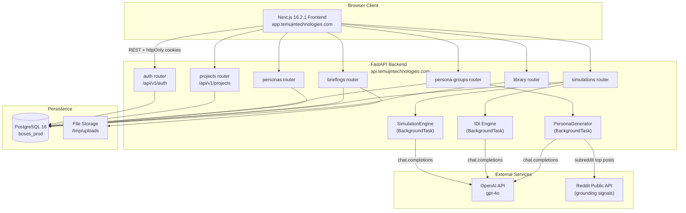

_Last updated: 2026-04-01_

# System Architecture

## Overview

Boses is a full-stack SaaS application for running AI-powered market simulations. It consists of a Next.js frontend and a FastAPI backend, communicating via a versioned REST API secured with JWT httpOnly cookies.

## System Diagram

## Auth Flow

Boses uses a dual-token JWT scheme with httpOnly cookies:

1. **Login**: `POST /api/v1/auth/login` → server sets two cookies:
   - `access_token`: short-lived (15 min), used for API authorization
   - `refresh_token`: long-lived (30 days), used only to rotate tokens
2. **Token refresh**: `POST /api/v1/auth/refresh` → rotates both tokens, revokes old refresh token in DB
3. **Silent refresh**: frontend detects 401 responses, calls `/refresh` before retrying the original request
4. **Logout**: `POST /api/v1/auth/logout` → server revokes refresh token, clears cookies
5. **Middleware**: Next.js middleware checks for `access_token` cookie; redirects unauthenticated users to `/login`

Cookies use `Secure=True` and `SameSite=Lax` in staging and production environments. In development (`ENVIRONMENT=development`) cookies are not marked Secure.

## Simulation Pipeline

The simulation system supports two modes: **concept tests** and **in-depth interviews (IDI)**.

**Concept test flow:**
1. Client `POST /api/v1/projects/{id}/simulations` with `simulation_type: "concept_test"`
2. Server returns `201` immediately and spawns a `BackgroundTask`
3. `SimulationEngine.run_simulation()` loads all personas in the group
4. For each persona: calls OpenAI `gpt-4o` at `temp=0.9` with persona context + briefing text
5. Parses structured result (sentiment, score, themes, quote) and saves a `SimulationResult` row
6. After all personas: generates an aggregate report at `temp=0.7`
7. Updates `simulation.status = "complete"`

**IDI (AI-automated) flow:**
1. Client uploads a script file (`POST /{id}/script`), then triggers `POST /{id}` with `simulation_type: "idi_ai"`
2. `IDIEngine.run_idi_ai()` runs as a background task
3. For each persona: conducts a multi-turn interview using the script questions
4. Generates a per-persona transcript and analysis report
5. Updates status and stores results

**IDI (manual) flow:**
1. Client creates simulation with `simulation_type: "idi_manual"`
2. User chats with the AI persona via `POST /{id}/messages`
3. Client ends the session via `POST /{id}/end`, which triggers report generation

## CORS

Allowed origins:
- `http://localhost:3000` (local development)
- `https://app.temujintechnologies.com` (production)
- `https://staging.temujintechnologies.com` (staging)
