_Last updated: 2026-04-01_

# Data Model

All tables use UUID primary keys. Timestamps are timezone-aware. The database is PostgreSQL 16 with JSONB and ARRAY column support.

## ER Diagram

```mermaid
erDiagram
    companies {
        uuid id PK
        string name
        string slug UK
        datetime created_at
        datetime updated_at
    }
    users {
        uuid id PK
        uuid company_id FK
        string email UK
        string hashed_password
        string full_name
        string role
        bool is_active
        string password_reset_token
        datetime password_reset_token_expiry
        datetime created_at
        datetime updated_at
    }
    refresh_tokens {
        uuid id PK
        uuid user_id FK
        string token_hash
        datetime expires_at
        datetime revoked_at
        datetime created_at
    }
    projects {
        uuid id PK
        uuid company_id FK
        string name
        text description
        datetime created_at
        datetime updated_at
    }
    persona_groups {
        uuid id PK
        uuid project_id FK
        string name
        text description
        int age_min
        int age_max
        string gender
        string location
        string occupation
        string income_level
        text psychographic_notes
        int persona_count
        string generation_status
        datetime created_at
        datetime updated_at
    }
    personas {
        uuid id PK
        uuid persona_group_id FK
        uuid library_persona_id FK
        string full_name
        int age
        string gender
        string location
        string occupation
        string income_level
        text educational_background
        text family_situation
        array personality_traits
        text values_and_motivations
        text pain_points
        text media_consumption
        text purchase_behavior
        text day_in_the_life
        string data_source
        array data_source_references
        jsonb raw_profile_json
        datetime created_at
    }
    library_personas {
        uuid id PK
        string full_name
        int age
        string gender
        string location
        string occupation
        string income_level
        text educational_background
        text family_situation
        text background
        array personality_traits
        text goals
        text pain_points
        string tech_savviness
        text media_consumption
        text spending_habits
        text day_in_the_life
        string data_source
        array data_source_references
        int simulation_count
        bool is_retired
        datetime created_at
        datetime updated_at
    }
    persona_library_links {
        uuid id PK
        uuid persona_id FK
        uuid library_persona_id FK
        float match_score
        datetime linked_at
    }
    briefings {
        uuid id PK
        uuid project_id FK
        string title
        text description
        string file_name
        string file_path
        string file_type
        text extracted_text
        datetime created_at
    }
    simulations {
        uuid id PK
        uuid project_id FK
        uuid persona_group_id FK
        uuid briefing_id FK
        text prompt_question
        string simulation_type
        text idi_script_text
        uuid idi_persona_id FK
        string status
        text error_message
        jsonb progress
        datetime created_at
        datetime completed_at
    }
    simulation_results {
        uuid id PK
        uuid simulation_id FK
        uuid persona_id FK
        string result_type
        string sentiment
        float sentiment_score
        text reaction_text
        array key_themes
        text notable_quote
        text summary_text
        jsonb sentiment_distribution
        array top_themes
        text recommendations
        text transcript
        jsonb report_sections
        datetime created_at
    }
    idi_messages {
        uuid id PK
        uuid simulation_id FK
        uuid persona_id FK
        string role
        text content
        datetime created_at
    }

    companies ||--o{ users : "has"
    companies ||--o{ projects : "owns"
    users ||--o{ refresh_tokens : "has"
    projects ||--o{ persona_groups : "has"
    projects ||--o{ briefings : "has"
    projects ||--o{ simulations : "has"
    persona_groups ||--o{ personas : "contains"
    persona_groups ||--o{ simulations : "used in"
    personas ||--o| persona_library_links : "linked via"
    library_personas ||--o{ persona_library_links : "linked via"
    briefings ||--o{ simulations : "used in"
    simulations ||--o{ simulation_results : "produces"
    simulations ||--o{ idi_messages : "has"
    personas ||--o{ simulation_results : "generates"
    personas ||--o{ idi_messages : "speaks in"
```

## Table Reference

### Auth Domain

**companies**
| Column | Type | Nullable | Notes |
|---|---|---|---|
| id | UUID | No | PK |
| name | String(255) | No | |
| slug | String(100) | No | Unique |
| created_at | DateTime(tz) | No | |
| updated_at | DateTime(tz) | No | |

**users**
| Column | Type | Nullable | Notes |
|---|---|---|---|
| id | UUID | No | PK |
| company_id | UUID | No | FK → companies.id |
| email | String(255) | No | Unique, indexed |
| hashed_password | String(255) | No | bcrypt |
| full_name | String(255) | Yes | |
| role | String(50) | No | Default: "owner" |
| is_active | Boolean | No | Default: true |
| password_reset_token | String(255) | Yes | |
| password_reset_token_expiry | DateTime(tz) | Yes | |
| created_at | DateTime(tz) | No | |
| updated_at | DateTime(tz) | No | |

**refresh_tokens**
| Column | Type | Nullable | Notes |
|---|---|---|---|
| id | UUID | No | PK |
| user_id | UUID | No | FK → users.id, CASCADE |
| token_hash | String(255) | No | Indexed; stored as bcrypt hash |
| expires_at | DateTime(tz) | No | |
| revoked_at | DateTime(tz) | Yes | Null = active |
| created_at | DateTime(tz) | No | |

### Core Domain

**projects**
| Column | Type | Nullable | Notes |
|---|---|---|---|
| id | UUID | No | PK |
| company_id | UUID | Yes | FK → companies.id, indexed |
| name | String(255) | No | |
| description | Text | Yes | |
| created_at | DateTime | No | |
| updated_at | DateTime | No | |

### Persona Domain

**persona_groups**
| Column | Type | Nullable | Notes |
|---|---|---|---|
| id | UUID | No | PK |
| project_id | UUID | No | FK → projects.id |
| name | String(255) | No | |
| description | Text | Yes | |
| age_min | Integer | No | |
| age_max | Integer | No | |
| gender | String(50) | No | |
| location | String(255) | No | |
| occupation | String(255) | No | |
| income_level | String(100) | No | |
| psychographic_notes | Text | Yes | |
| persona_count | Integer | No | Default: 5 |
| generation_status | String(50) | No | pending / generating / complete / failed |
| created_at | DateTime | No | |
| updated_at | DateTime | No | |

**personas**
| Column | Type | Nullable | Notes |
|---|---|---|---|
| id | UUID | No | PK |
| persona_group_id | UUID | No | FK → persona_groups.id |
| library_persona_id | UUID | Yes | FK → library_personas.id |
| full_name | String(255) | No | |
| age | Integer | No | |
| gender | String(50) | No | |
| location | String(255) | No | |
| occupation | String(255) | No | |
| income_level | String(100) | No | |
| educational_background | Text | Yes | |
| family_situation | Text | Yes | |
| personality_traits | ARRAY(String) | Yes | |
| values_and_motivations | Text | Yes | |
| pain_points | Text | Yes | |
| media_consumption | Text | Yes | |
| purchase_behavior | Text | Yes | |
| day_in_the_life | Text | Yes | |
| data_source | String(50) | No | synthetic / library |
| data_source_references | ARRAY(String) | Yes | Reddit post URLs etc. |
| raw_profile_json | JSONB | Yes | Full GPT output |
| created_at | DateTime | No | |

**library_personas**
| Column | Type | Nullable | Notes |
|---|---|---|---|
| id | UUID | No | PK |
| full_name | String(255) | No | |
| age | Integer | No | |
| gender | String(50) | No | |
| location | String(255) | No | |
| occupation | String(255) | No | |
| income_level | String(100) | No | |
| educational_background | Text | Yes | |
| family_situation | Text | Yes | |
| background | Text | Yes | |
| personality_traits | ARRAY(String) | Yes | |
| goals | Text | Yes | |
| pain_points | Text | Yes | |
| tech_savviness | String(100) | Yes | |
| media_consumption | Text | Yes | |
| spending_habits | Text | Yes | |
| day_in_the_life | Text | Yes | |
| data_source | String(50) | No | Default: synthetic |
| data_source_references | ARRAY(String) | Yes | |
| simulation_count | Integer | No | Default: 0 |
| is_retired | Boolean | No | Default: false |
| created_at | DateTime(tz) | No | |
| updated_at | DateTime(tz) | No | |

**persona_library_links**
| Column | Type | Nullable | Notes |
|---|---|---|---|
| id | UUID | No | PK |
| persona_id | UUID | No | FK → personas.id, CASCADE, unique |
| library_persona_id | UUID | No | FK → library_personas.id |
| match_score | Float | Yes | 0.0–1.0; threshold 0.70 |
| linked_at | DateTime(tz) | No | |

### Simulation Domain

**briefings**
| Column | Type | Nullable | Notes |
|---|---|---|---|
| id | UUID | No | PK |
| project_id | UUID | No | FK → projects.id |
| title | String(255) | No | |
| description | Text | Yes | |
| file_name | String(500) | No | |
| file_path | String(1000) | No | Absolute path under UPLOAD_DIR |
| file_type | String(50) | No | pdf / image / text |
| extracted_text | Text | Yes | Extracted by pdfminer or OCR |
| created_at | DateTime | No | |

**simulations**
| Column | Type | Nullable | Notes |
|---|---|---|---|
| id | UUID | No | PK |
| project_id | UUID | No | FK → projects.id |
| persona_group_id | UUID | No | FK → persona_groups.id, CASCADE |
| briefing_id | UUID | Yes | FK → briefings.id, SET NULL |
| prompt_question | Text | Yes | |
| simulation_type | String(50) | No | concept_test / idi_ai / idi_manual |
| idi_script_text | Text | Yes | Parsed from uploaded .txt/.docx |
| idi_persona_id | UUID | Yes | FK → personas.id, SET NULL |
| status | String(50) | No | pending / running / complete / failed / aborted |
| error_message | Text | Yes | |
| progress | JSONB | Yes | Per-persona completion tracking |
| created_at | DateTime | No | |
| completed_at | DateTime | Yes | |

**simulation_results**
| Column | Type | Nullable | Notes |
|---|---|---|---|
| id | UUID | No | PK |
| simulation_id | UUID | No | FK → simulations.id |
| persona_id | UUID | Yes | FK → personas.id, SET NULL; null for aggregate rows |
| result_type | String(50) | No | individual / aggregate / idi_individual / idi_aggregate |
| sentiment | String(50) | Yes | positive / neutral / negative |
| sentiment_score | Float | Yes | -1.0 to 1.0 |
| reaction_text | Text | Yes | Full persona reaction |
| key_themes | ARRAY(String) | Yes | |
| notable_quote | Text | Yes | |
| summary_text | Text | Yes | Aggregate summary |
| sentiment_distribution | JSONB | Yes | {positive: %, neutral: %, negative: %} |
| top_themes | ARRAY(String) | Yes | |
| recommendations | Text | Yes | |
| transcript | Text | Yes | IDI full transcript |
| report_sections | JSONB | Yes | IDI structured report |
| created_at | DateTime | No | |

**idi_messages**
| Column | Type | Nullable | Notes |
|---|---|---|---|
| id | UUID | No | PK |
| simulation_id | UUID | No | FK → simulations.id, CASCADE |
| persona_id | UUID | Yes | FK → personas.id, SET NULL |
| role | String(20) | No | user / persona |
| content | Text | No | |
| created_at | DateTime | No | |
