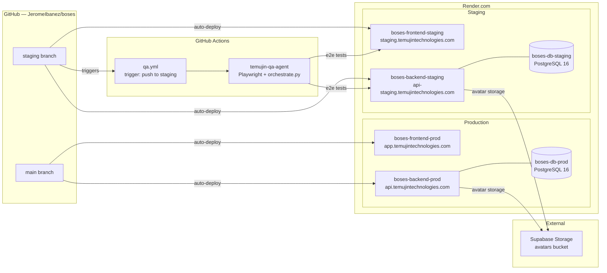

_Last updated: 2026-04-05_

# Deployment

Boses runs on [Render.com](https://render.com) with two environments: production (main branch) and staging (staging branch). Each environment has its own frontend, backend, and PostgreSQL database.

## Infrastructure Diagram



## Services

| Name | Type | Branch | Domain | Dockerfile |
|---|---|---|---|---|
| boses-backend-prod | web | main | api.temujintechnologies.com | backend/Dockerfile |
| boses-backend-staging | web | staging | api-staging.temujintechnologies.com | backend/Dockerfile |
| boses-frontend-prod | web | main | app.temujintechnologies.com | frontend/Dockerfile |
| boses-frontend-staging | web | staging | staging.temujintechnologies.com | frontend/Dockerfile |
| boses-db-prod | database | — | (internal) | PostgreSQL 16 |
| boses-db-staging | database | — | (internal) | PostgreSQL 16 |

## Environment Variables

| Service | Key | Value / Source |
|---|---|---|
| backend-prod | DATABASE_URL | fromDatabase: boses-db-prod |
| backend-prod | OPENAI_API_KEY | Secret (manual) |
| backend-prod | JWT_SECRET | Secret (manual) |
| backend-prod | OPENAI_MODEL | gpt-4o |
| backend-prod | UPLOAD_DIR | /tmp/uploads |
| backend-prod | SUPABASE_URL | Secret (manual) |
| backend-prod | SUPABASE_SERVICE_KEY | Secret (manual) |
| backend-prod | SUPABASE_AVATARS_BUCKET | avatars |
| backend-staging | DATABASE_URL | fromDatabase: boses-db-staging |
| backend-staging | OPENAI_API_KEY | Secret (manual) |
| backend-staging | JWT_SECRET | Secret (manual) |
| backend-staging | OPENAI_MODEL | gpt-4o |
| backend-staging | UPLOAD_DIR | /tmp/uploads |
| backend-staging | SUPABASE_URL | Secret (manual) |
| backend-staging | SUPABASE_SERVICE_KEY | Secret (manual) |
| backend-staging | SUPABASE_AVATARS_BUCKET | avatars |
| frontend-prod | NEXT_PUBLIC_API_URL | https://api.temujintechnologies.com/api/v1 |
| frontend-staging | NEXT_PUBLIC_API_URL | https://api-staging.temujintechnologies.com/api/v1 |

## Docker

**Backend (`backend/Dockerfile`)**
- Base image: `python:3.12-slim`
- Installs PostgreSQL client libraries
- Startup script (`start.sh`): runs `alembic upgrade head` then starts `uvicorn` on port 8000

**Frontend (`frontend/Dockerfile`)**
- Multi-stage build using `node:20-alpine`
- Builder stage: `npm ci && next build` (standalone output mode)
- Runner stage: serves pre-built output on port 3000

## CI/CD

Workflow: `.github/workflows/qa.yml`
Trigger: push to `staging` branch

Steps:
1. Checkout Boses repo
2. Checkout `JeromeIbanez/temujin-qa-agent` into `.qa-agent/`
3. Install Python 3.12 + Playwright (Chromium)
4. Wait for staging to return HTTP 200 (12 retries × 15s = 3 minutes max)
5. Run Playwright e2e tests from `tests/e2e/` (non-blocking)
6. Run `orchestrate.py` from the QA agent (sends email report, auto-promotes to main on pass)

Secrets consumed: `GH_TOKEN`, `OPENAI_API_KEY`, `GMAIL_USER`, `GMAIL_APP_PASSWORD`

## Local Development

```bash
# Start PostgreSQL + pgAdmin
docker compose up -d

# Backend
cd backend
python -m venv venv && source venv/bin/activate
pip install -r requirements.txt
alembic upgrade head
uvicorn app.main:app --reload --port 8000

# Frontend
cd frontend
npm install
npm run dev
```

Local URLs: frontend `http://localhost:3000`, backend `http://localhost:8000`, pgAdmin `http://localhost:5050`

Avatar storage falls back to local filesystem (`{UPLOAD_DIR}/avatars/`) when `SUPABASE_URL` / `SUPABASE_SERVICE_KEY` are not set. Avatars are served at `/uploads/avatars/{persona_id}.png`.
