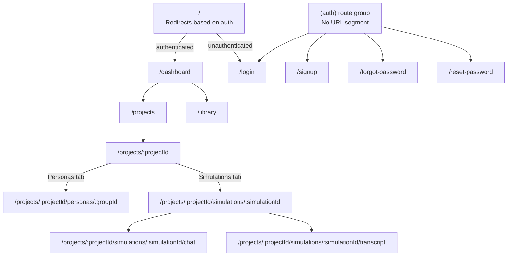

_Last updated: 2026-04-01_

# Frontend

Built with Next.js 16.2.1 using the App Router. TypeScript throughout.

## Route Tree

## Auth Redirect Logic (middleware.ts)

| Condition | Action |
|---|---|
| No `access_token` cookie + protected route | Redirect to `/login` |
| Has `access_token` cookie + auth route (`/login`, `/signup`, etc.) | Redirect to `/dashboard` |
| All other cases | Allow through |

Public paths (no auth required): `/login`, `/signup`, `/forgot-password`, `/reset-password`

## Route Reference

| Route | Component | Notes |
|---|---|---|
| `/` | `app/page.tsx` | Redirects via middleware |
| `/login` | `app/(auth)/login/page.tsx` | |
| `/signup` | `app/(auth)/signup/page.tsx` | |
| `/forgot-password` | `app/(auth)/forgot-password/page.tsx` | |
| `/reset-password` | `app/(auth)/reset-password/page.tsx` | |
| `/dashboard` | `app/dashboard/page.tsx` | Project cards overview |
| `/projects` | `app/projects/page.tsx` | Project list |
| `/projects/:projectId` | `app/projects/[projectId]/page.tsx` | Tabbed: Briefings, Personas, Simulations |
| `/projects/:projectId/personas/:groupId` | `app/projects/[projectId]/personas/[groupId]/page.tsx` | Persona detail |
| `/projects/:projectId/simulations/:simulationId` | `app/projects/[projectId]/simulations/[simulationId]/page.tsx` | Results / status |
| `/projects/:projectId/simulations/:simulationId/chat` | `.../chat/page.tsx` | Manual IDI chat interface |
| `/projects/:projectId/simulations/:simulationId/transcript` | `.../transcript/page.tsx` | IDI transcript view |
| `/library` | `app/library/page.tsx` | Persona library browser |

## API Client

`frontend/lib/api.ts` wraps `fetch()` with:
- Base URL: `process.env.NEXT_PUBLIC_API_URL`
  - Dev: `http://localhost:8000/api/v1`
  - Production: `https://api.temujintechnologies.com/api/v1`
  - Staging: `https://api-staging.temujintechnologies.com/api/v1`
- `credentials: "include"` on all requests (sends cookies)
- `Content-Type: application/json` default

## State Management

TanStack Query (`@tanstack/react-query` v5) handles all server state:
- Queries for list/detail endpoints
- Mutations for create/update/delete
- Polling for simulation status (until `status === "complete"` or `"failed"`)

Auth state is managed via `AuthContext` (`frontend/contexts/AuthContext.tsx`), which stores the current user and exposes login/logout functions.
