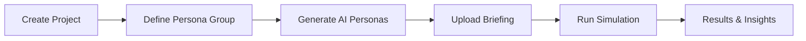

## What is Boses?

**Boses** is an AI-powered market research platform built for Southeast Asian markets (Indonesia, Philippines, Vietnam).

Instead of running traditional research studies that take weeks and cost thousands of dollars, Boses lets you:

1. **Generate culturally grounded personas** — backed by real consumer signals from Reddit, Shopee, and app store reviews
2. **Run simulations in minutes** — concept tests, surveys, focus groups, in-depth interviews, and conjoint analyses
3. **Get results you can act on** — sentiment breakdowns, key themes, quotes, and strategic recommendations

---

## Who is it for?

| User | Use Case |
|------|----------|
| **FMCG brand teams** | Test packaging, pricing, and campaign messaging before launch |
| **Marketing agencies** | Rapidly prototype creative directions for SEA clients |
| **Product managers** | Validate product concepts with target segments in PH/ID/VN |
| **Strategy consultants** | Supplement qualitative research with fast AI-driven insight |

---

## How it works

1. **Project** — the container for your research initiative
2. **Persona Group** — demographic and psychographic definition of your target segment
3. **Personas** — AI-generated individuals within the group, grounded in real market ethnography
4. **Briefing** — your product brief, campaign concept, or stimulus material (PDF or text)
5. **Simulation** — the research method you want to run against your personas

---

## Base URLs

| Environment | URL |
|-------------|-----|
| Production  | `https://api.temujintechnologies.com` |
| Staging     | `https://api-staging.temujintechnologies.com` |

All endpoints are prefixed with `/api/v1`.

<CardGroup cols={2}>
  <Card title="Authentication" icon="key" href="/authentication">
    How to get and use your JWT access token
  </Card>
  <Card title="Quickstart" icon="rocket" href="/quickstart">
    Run your first simulation in under 5 minutes
  </Card>
  <Card title="API Reference" icon="code" href="/api-reference/overview">
    Full interactive endpoint documentation
  </Card>
  <Card title="Core Concepts" icon="book" href="/concepts/simulations">
    Learn about simulation types and persona generation
  </Card>
</CardGroup>
